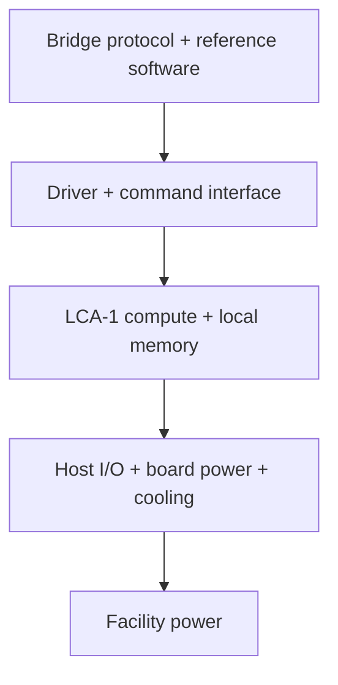

# LCA-1

> **Status: architecture discovery.** LCA-1 has no RTL, FPGA result, tapeout, or measured speedup yet. This repository defines what must be true before any of those claims are made.

LCA-1 is an evidence-gated architecture project for a chip specialized to the **Lattice Bridge** workload.

The project starts from a deliberately narrow hypothesis:

> If end-to-end profiling shows that a stable set of arithmetic and data-movement kernels dominates the Lattice Bridge workload, a specialized accelerator may reduce latency and energy per completed bridge operation.

That is a hypothesis to test, not a conclusion embedded in the name.

## The system boundary



The chip is one layer of the system, not the product. Kernel throughput is irrelevant if host transfers, memory traffic, control-plane work, power delivery, or verification dominates the completed operation.

## Candidate workload map

These are **profiling candidates**, not committed silicon blocks.

| Candidate | Why profile it | Evidence required before specialization |
|---|---|---|
| Polynomial transforms such as NTT/INTT | Often expose regular parallel arithmetic in lattice workloads | Share of end-to-end runtime, transform sizes, modulus set, reuse |
| Modular multiply and reduction | May dominate arithmetic within transform and pointwise stages | Instruction count, operand widths, pipeline utilization |
| SHAKE/Keccak and hashing | Can become a separate bottleneck after arithmetic is accelerated | Bytes hashed per operation and overlap with arithmetic |
| Sampling and rejection paths | May carry irregular control flow and security constraints | Distribution, rejection rate, timing behavior |
| Packing, unpacking, and checks | Data movement can erase an arithmetic-only speedup | Bytes moved, host copies, memory locality |

The first architecture decision is therefore not “how many NTT lanes?” It is “does the measured workload justify fixed hardware, and where is the actual system bottleneck?”

## Truth gates

| Claim | Minimum evidence |
|---|---|
| Functional equivalence | Known-answer tests plus differential tests against a pinned reference implementation |
| Performance | End-to-end bridge operations per second against named CPU and GPU baselines, including all transfers |
| Energy efficiency | Joules per completed operation from repeatable board-level measurements, with idle power reported separately |
| Security | Written threat model, constant-time review where applicable, fault behavior, secret-lifetime analysis, and explicit side-channel scope |
| Implementability | Reproducible synthesis, timing, area, SRAM, and power reports against a named process/library or FPGA target |
| System value | Measured evidence that acceleration survives host I/O, memory, driver, power-delivery, and thermal constraints |

No percentage, “x faster,” or PPA claim belongs in this README until its artifact is checked into the repository.

## Milestones

- [ ] **M0 — Freeze the question:** pin the Lattice Bridge reference workload, datasets, parameter sets, trust boundary, and success metrics.
- [ ] **M1 — Establish baselines:** reproducible CPU and GPU runs with whole-operation profiles, power methodology, and raw results.
- [ ] **M2 — Build an executable model:** bit-accurate arithmetic, memory-traffic model, cycle model, and sensitivity sweeps.
- [ ] **M3 — Prove one RTL slice:** implement only the dominant measured kernel; verify it against the executable model.
- [ ] **M4 — Validate on FPGA:** include driver, memory movement, realistic queues, board power, and thermal behavior.
- [ ] **M5 — Make the ASIC decision:** synthesize candidate architectures and compare end-to-end value against continued CPU/GPU/FPGA deployment.

A milestone advances only when its evidence is reproducible from the repository.

## Metrics that matter

The primary result is not raw operations per cycle. It is a compact system scorecard:

- completed Lattice Bridge operations per second;
- median and tail latency at named batch sizes;
- joules per completed operation;
- peak and sustained board power;
- bytes transferred per operation;
- accelerator and memory utilization;
- area, frequency, SRAM, and estimated power after synthesis;
- correctness and security-test coverage.

Every result should include tool versions, hardware identity, parameter set, run count, and raw output.

## Grid-to-gate context

LCA-1 is the compute end of a larger systems thread:

- **Legacy generation:** a new turbine inside a 1965 power plant still inherits the steam system, switchyard, protection, controls, and operating regime around it.
- **Power conversion:** [VoltForge](https://github.com/0xSoftBoi/GaN-optimization-) explores GaN/SiC converter design, but a faster switch still inherits magnetics, EMI, control, cooling, and calibration constraints.
- **Specialized compute:** LCA-1 must inherit the bridge protocol, software, memory, board, power, thermal, and security constraints.
- **Evidence:** [roce-preflight](https://github.com/0xSoftBoi/roce-preflight) is the reminder that passing software tests and real hardware state are different kinds of truth.

The recurring engineering question is the same at every layer:

> Where does the new component meet the inherited system—and which interface invalidates the headline gain?

For LCA-1, the power profile produced by a realistic workload should eventually become an input to board power-delivery and VoltForge studies. That is the direct bridge between the chip and energy work.

## Planned repository shape

```text
spec/          workload, threat model, interfaces, acceptance gates
reference/     pinned software model and known-answer vectors
bench/         CPU/GPU baselines, profilers, raw results
model/         bit-accurate and cycle/traffic models
rtl/           hardware blocks and assertions
verification/  differential, cocotb, and formal checks
fpga/          integration, driver, and board measurements
reports/       generated synthesis/PPA artifacts with provenance
```

The immediate next artifact is the M0 workload and threat-model specification.
