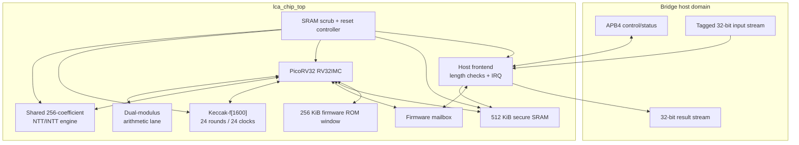

# LCA-1 full-chip architecture

## Design objective

LCA-1 is specialized for a bridge that receives already-generated lattice
objects. It implements ML-KEM-768 decapsulation and ML-DSA-65 verification,
not key generation, encapsulation, or signing. This removes entropy-dependent
private signing logic and dedicates the area to the two bridge hot paths.

The design is a hardware/software co-design. Immutable RV32 firmware executes
the standardized algorithm control and byte/bit codecs. Dedicated blocks
execute all Keccak-f[1600] permutations and every polynomial NTT/INTT. This
gives a complete command-level chip while keeping parameter-sensitive parsing
auditable in C.

## Block hierarchy

| module | responsibility |
| --- | --- |
| `lca_chip_top` | CPU/memory/peripheral integration, arbitration, zeroization, portable ASIC/FPGA boundary |
| `lca_host_frontend` | APB registers, tagged DMA writes, exact-length checks, command/result lifetime, IRQ |
| `picorv32` | algorithm sequencing and standardized codecs from immutable firmware |
| `lca_keccak_f1600` | iterative Keccak permutation shared by SHAKE128, SHAKE256, SHA3-256, and SHA3-512 |
| `lca_ntt_accel` | in-place forward/inverse transforms for both Level-3 lattice rings |
| `lca_secure_sram` | one-read/one-write portable memory model and ASIC macro-replacement boundary |
| `lca_core` | retained fixed-iteration dual-modulus arithmetic characterization lane |

## Locked cryptographic profiles

| property | ML-KEM-768 | ML-DSA-65 |
| --- | ---: | ---: |
| polynomial degree | 256 | 256 |
| coefficient modulus | 3,329 | 8,380,417 |
| module dimensions | `k=3` | `k=6`, `l=5` |
| chip operation | decapsulation | signature verification |
| public/input object sizes | CT 1,088 B | PK 1,952 B; SIG 3,309 B |
| secret object size | DK 2,400 B | none |
| result | 32-byte secret | valid/invalid status |

The project uses the final NIST Level-3 profiles from FIPS 203 and FIPS 204.
It does not dynamically select other ML-KEM or ML-DSA parameter sets.

## Memory map

The CPU sees the following address spaces:

| range/base | size | use |
| --- | ---: | --- |
| `0x0000_0000` | 256 KiB | immutable firmware ROM |
| `0x1000_0000` | 384 KiB | firmware data, stack, and cryptographic work RAM |
| `0x1006_0000` | 128 KiB window | fixed host-object buffers |
| `0x2000_0000` | 4 KiB | firmware mailbox and entropy holding register |
| `0x2000_1000` | 4 KiB | Keccak control/state window |
| `0x2000_2000` | 4 KiB | NTT control/coefficient window |
| `0x2000_3000` | 4 KiB | arithmetic characterization lane |

The fixed host buffers are non-overlapping:

| CPU address | object | reserved bytes |
| --- | --- | ---: |
| `0x1006_0000` | ML-DSA public key | 2,048 |
| `0x1006_0800` | ML-DSA signature | 3,584 |
| `0x1006_1600` | message | 65,536 |
| `0x1007_1600` | context | 256 |
| `0x1007_1700` | ML-KEM decapsulation key | 2,432 |
| `0x1007_2080` | ML-KEM ciphertext | 1,088 |

The gaps make every object naturally word-aligned while exact protocol lengths
remain enforced by the frontend.

## Command lifecycle

1. The host clears old input metadata and streams each tagged object.
2. The frontend writes accepted words directly into the object's SRAM region.
3. The host selects a command and writes `START`.
4. The frontend checks all required loaded bits and exact lengths, snapshots
   the command, raises `busy`, and exposes it to the firmware mailbox.
5. Firmware atomically claims the command. The host-visible `busy` remains set.
6. Firmware calls the pinned ML-KEM or ML-DSA clean API. The FIPS 202 adapter
   transfers each 1,600-bit state to the Keccak peripheral; the NTT adapter
   transfers each 256-coefficient polynomial to the shared NTT peripheral.
7. Firmware writes the result words and result length, then commits a result
   code as the final mailbox write.
8. The frontend latches `done`, drops `busy`, asserts IRQ, and—only for a
   successful decapsulation—presents the 32-byte output stream.
9. Host acknowledgement clears status and overwrites the result registers.
   Full host/tamper zeroization additionally scrubs the entire SRAM and reboots.

Only one operation can be outstanding. Firmware claim does not end the
host-visible transaction, preventing a false-idle gap between dispatch and
completion.

## Keccak peripheral

The Keccak block stores 25 little-endian 64-bit lanes behind a 50-word 32-bit
window. A control write starts the permutation. One full theta/rho/pi/chi/iota
round is evaluated per clock for a fixed 24-clock busy interval. Padding,
domain separation, absorb/squeeze, and incremental-context management remain in
firmware, so the same permutation supports every hash/XOF call used by both
algorithms.

The block-level differential test loads 16 randomized states and compares all
25 result lanes with an independent C++ Keccak reference.

## Shared NTT peripheral

The NTT block contains one 256×32 coefficient scratchpad and four commands:

| command | transform | measured busy clocks |
| ---: | --- | ---: |
| `0` | ML-DSA forward NTT | 1,024 |
| `1` | ML-DSA inverse NTT to Montgomery domain | 1,280 |
| `2` | ML-KEM forward NTT | 896 |
| `3` | ML-KEM inverse NTT to Montgomery domain | 1,152 |

Each clock updates one butterfly. Twiddle constants and narrowing semantics are
generated from and differential-tested against the pinned clean sources.
ML-KEM's two-coefficient NTT-domain base multiplication remains in firmware;
all complete transforms use hardware.

## Memory and arbitration

The SRAM model has an asynchronous read and a synchronous byte-write port.
CPU writes, host DMA, and zeroization share the write port with this priority:

1. zeroization;
2. host DMA;
3. CPU write.

When a host write collides with a CPU SRAM access, the CPU memory transaction is
stalled for that clock. Host ingress is disabled while a command is busy, so
the cryptographic workload has exclusive access after launch.

An ASIC synchronous-read macro cannot be dropped in blindly. Its wrapper must
either preserve the visible zero-wait read behavior or add the corresponding
`mem_ready` wait-state logic and re-run whole-chip firmware tests.

## Zeroization

A host control bit or external `tamper_i` starts zeroization. The trigger:

- clears frontend status, result words, and metadata;
- clears the Keccak state and all NTT coefficients;
- discards the entropy holding register;
- holds the CPU in reset;
- writes zero to all 131,072 SRAM words.

The scrub takes 131,072 clocks plus entry/exit control edges. If `tamper_i`
remains asserted, the CPU stays reset and the controller begins another scrub
after completing the current pass.

## Retained arithmetic bring-up lane

`src/tt_um_suwappu_lattice_accel.v` is a separate byte-wide Tiny Tapeout top
around `lca_core`. It characterizes modular multiply and butterfly behavior for
both moduli but is not in the bridge command path. Keeping it lets the project
compare a small first-silicon vehicle with the larger FPGA/ASIC SoC without
misrepresenting the tiny wrapper as a full cryptographic chip.
