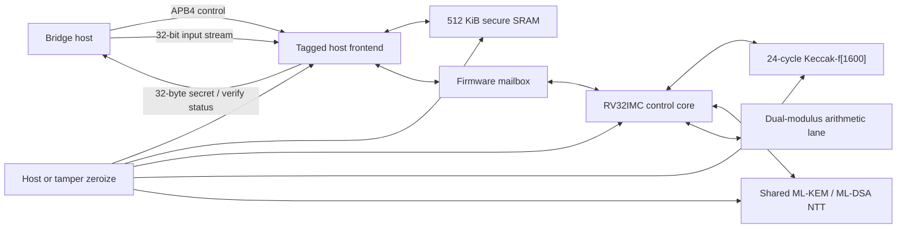

# Suwappu Lattice Bridge Chip (LCA-1)

LCA-1 is a complete Level-3 post-quantum bridge coprocessor design. Its product
top, `lca_chip_top`, accepts standard wire-format objects and executes the two
operations the bridge needs:

- ML-KEM-768 decapsulation, including FIPS 203 implicit rejection, with a
  32-byte shared-secret output;
- ML-DSA-65 signature verification, including the FIPS 204 context string,
  over messages up to 64 KiB.

The repository contains synthesizable RTL, immutable RV32 firmware, pinned
cryptographic sources, host and accelerator interfaces, zeroization logic, and
whole-chip differential simulation. It is a chip design—not fabricated or
production-qualified silicon. Place-and-route, SRAM-macro integration, timing
closure, DRC/LVS, fault testing, and side-channel evaluation remain open gates.

## What is in the chip



The hardware/software split keeps the format parsing and algorithm control in
small immutable firmware while moving every Keccak permutation and every
forward/inverse NTT into dedicated hardware. The same NTT scratchpad supports
both bridge parameter sets:

| bridge operation | standardized profile | chip command |
| --- | --- | ---: |
| materialize a lattice envelope | ML-KEM-768, FIPS 203 | `0x02` decapsulate |
| verify a commitment or signed tree head | ML-DSA-65, FIPS 204 | `0x01` verify |
| boot/diagnostic check | SHAKE256 of the empty string | `0x03` self-test |

The design is locked to the Level-3 sizes: 2,400-byte ML-KEM decapsulation
keys, 1,088-byte ciphertexts, 1,952-byte ML-DSA public keys, and 3,309-byte
signatures. See the official [FIPS 203](https://csrc.nist.gov/pubs/fips/203/final)
and [FIPS 204](https://csrc.nist.gov/pubs/fips/204/final) publications.

CHIPS Alliance's Adams Bridge is a valuable open root-of-trust reference, but
its hardware specification implements ML-DSA-87 and ML-KEM-1024. Those are
Level-5 profiles, so wrapping it would not correctly implement Suwappu's
Level-3 bridge. LCA-1 instead pins the exact Level-3 sources and shares custom
Keccak/NTT hardware. See the official
[Adams Bridge specification](https://chipsalliance.github.io/caliptra-web/docs/2.1/hardware/adams_bridge_spec.html).

## Current verification result

All rows below were executed against this tree:

| evidence | result |
| --- | --- |
| freestanding RV32IMC firmware build | pass; 9,236-byte binary |
| Keccak-f[1600] RTL vs independent reference | pass; 16 randomized states |
| ML-DSA forward/inverse NTT RTL vs pinned C | pass; exact coefficient match |
| ML-KEM forward/inverse NTT RTL vs pinned C | pass; exact coefficient match |
| host frontend APB/stream/mailbox/zeroize test | pass |
| software algorithm oracle, including tamper cases | pass |
| whole-chip firmware + RTL ML-KEM-768 decapsulation | pass; shared secret matched |
| whole-chip firmware + RTL ML-DSA-65 verification with context | pass |
| integrated Yosys process/opt/memory/check | pass; no structural errors |
| FPGA timing and resource closure | pending |
| ASIC macro integration, P&R, DRC/LVS, and timing signoff | pending |
| side-channel/fault evaluation and independent security review | pending |

The whole-chip CXXRTL run measured 55,063 busy cycles for self-test, 3,618,151
for ML-KEM-768 decapsulation, and 7,590,585 for ML-DSA-65 verification. These
are deterministic RTL-simulation counts for the tested valid inputs, not a
frequency, PPA, or silicon-performance claim.

## Interfaces

The portable digital top exposes:

- a 32-bit APB4 control/status slave;
- a tagged 32-bit ready/valid input stream with byte strobes;
- a ready/valid 32-bit output stream for the ML-KEM shared secret;
- a conditioned-entropy input reserved for masking and future hardened
  firmware;
- interrupt, busy, firmware-trap, and zeroize status outputs;
- a level-sensitive tamper input that resets the CPU and scrubs all SRAM.

Input tags map directly to isolated SRAM regions:

| tag | object | maximum or exact bytes |
| ---: | --- | ---: |
| `0` | ML-DSA-65 public key | 1,952 exact |
| `1` | ML-DSA-65 signature | 3,309 exact |
| `2` | message | 65,536 maximum |
| `3` | FIPS 204 context | 255 maximum |
| `4` | ML-KEM-768 decapsulation key | 2,400 exact |
| `5` | ML-KEM-768 ciphertext | 1,088 exact |

The frontend refuses to launch until the required objects have exact lengths.
See [the command ABI](docs/COMMAND_ABI.md) for the register map and complete
stream contract.

## Build and run

Initialize the pinned dependencies first:

```bash
git submodule update --init --recursive
```

Build the immutable firmware with Zig's freestanding RISC-V compiler:

```bash
make firmware ZIG=zig
```

Run the fast algorithm, accelerator, and interface regressions:

```bash
make test-pqclean test-datapaths test-frontend
```

Boot the actual firmware in the complete CPU/ROM/SRAM/accelerator model and
run both bridge commands against the independent host oracle:

```bash
make test-soc
```

Run the full RTL suite and integrated structural check:

```bash
make test
make check-fullchip
```

The RTL tests require Yosys with CXXRTL, `yosys-config`, and a C++17 compiler.
The whole-chip simulator is intentionally a heavier build because it compiles
the complete CPU and memory system.

## Repository map

| path | purpose |
| --- | --- |
| `rtl/lca_chip_top.sv` | portable full-chip digital integration boundary |
| `rtl/lca_host_frontend.sv` | APB, tagged streams, validation, results, IRQ |
| `rtl/lca_keccak_f1600.sv` | one-round-per-clock Keccak permutation |
| `rtl/lca_ntt_accel.sv` | shared 256-coefficient Level-3 NTT/INTT engine |
| `rtl/lca_secure_sram.sv` | portable SRAM model and ASIC macro boundary |
| `firmware/` | boot code, runtime, MMIO adapters, command loop |
| `third_party/PQClean` | pinned Level-3 clean algorithm source |
| `third_party/picorv32` | pinned RV32 control core |
| `test/` | block, frontend, oracle, and whole-chip regressions |
| `src/` | retained Tiny Tapeout arithmetic bring-up lane |

The byte-wide Tiny Tapeout wrapper is still useful as a small arithmetic
characterization vehicle, but it is not the product top and does not implement
the full algorithms. Its vectors remain in [the bring-up guide](docs/BRINGUP.md).

## Security status

LCA-1 is not an HSM and is not FIPS validated. The current implementation is
unmasked, has no redundant fault-detection path, and has not been evaluated for
power, EM, timing, voltage, clock, laser, or memory-remanence attacks. The
zeroize controller and exact-length validation are useful design controls, not
a substitute for physical-security validation. Do not put production bridge
decapsulation keys through this revision. Read [SECURITY.md](SECURITY.md) before
integrating it.
