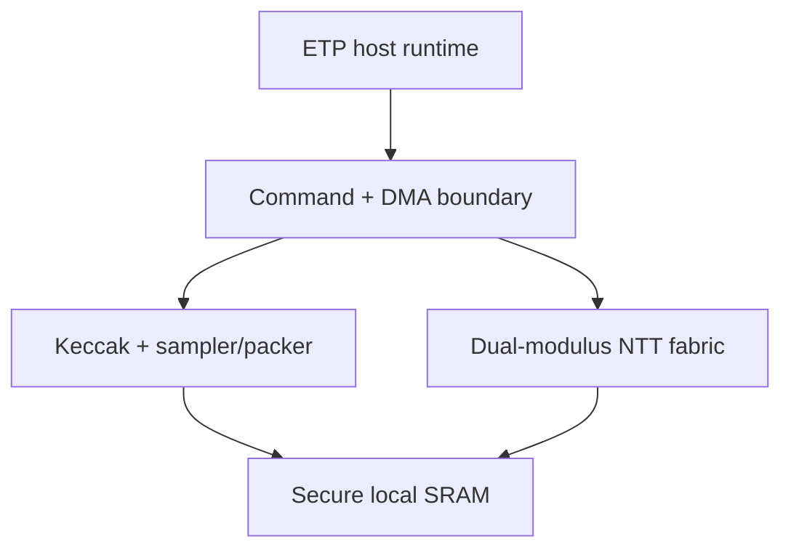

# LCA-1 architecture

## Product boundary

LCA-1 is a host-attached cryptographic coprocessor for ETP relayers,
materializers, and verifiers. Bridge policy, finality, replay protection,
routing, and token execution stay in host software.

## Proposed blocks

| Block | Responsibility | Phase |
|---|---|---|
| Host command/DMA | bounded descriptors, length checks, completion and fault reporting | v1 |
| Dual-modulus coefficient ALU | add, subtract, multiply, reduce for `q=3329` and `q=8380417` | v0 |
| NTT fabric | forward/inverse transform and pointwise multiply over 256 coefficients | v1 |
| Keccak-f[1600] | SHA3/SHAKE absorb/squeeze used across ML-KEM and ML-DSA | v1 |
| Sampler/packer | rejection/CBD sampling and standard byte encodings | v2 |
| Secure SRAM | keys, polynomials, scratch, explicit zeroization | v1 |
| Entropy port | approved external DRBG/RBG interface; no ad-hoc on-chip RNG claim | v2 |
| Fault monitor | timeout, illegal opcode, length mismatch, reset/zeroize completion | v1 |
| Telemetry | cycles, stalls, bytes, active/idle time, errors, power-state trace | v0/v1 |

## v0 arithmetic slice

The implemented slice uses one 24-bit datapath because both approved moduli are
below `2^23`. Modular multiplication is a 24-iteration shift/add algorithm:

1. conditionally add the current multiplicand to the product;
2. double the multiplicand modulo `q`;
3. shift the multiplier right;
4. repeat for all 24 bits.

Properties:

- constant 24-cycle latency independent of operand values;
- no divider or data-dependent loop;
- one RTL source supports both NIST moduli;
- intentionally area-oriented rather than throughput-oriented;
- suitable as an executable reference before choosing Barrett or Montgomery pipelines.

A butterfly computes `t=b*w mod q`, then `(a+t mod q, a-t mod q)`.
Replicating and banking this slice is a later synthesis decision.

## Memory and host strategy

The first full engine should keep a complete 256-coefficient polynomial on
chip. A 24-bit canonical representation is 768 bytes per polynomial. The
ML-DSA-65 matrix dimensions `(6,5)` and intermediate vectors make bandwidth and
bank conflicts first-class architecture constraints; SRAM is not sized from a
single butterfly benchmark.

The host submits bounded descriptors referencing input/output buffers. The
accelerator validates opcode, parameter set, lengths, alignment, and overlap
before touching secrets. No arbitrary microcode is accepted in v1.

## Selection gates for v1

Do not choose lane count, banking, frequency, or process until:

1. ETP real-backend profiles identify NTT/Keccak/memory shares;
2. v0 RTL is synthesized on a named FPGA;
3. host-transfer overhead is measured;
4. an energy model is calibrated with board measurements;
5. end-to-end speedup remains after AEAD, Merkle, erasure, and bridge checks.
